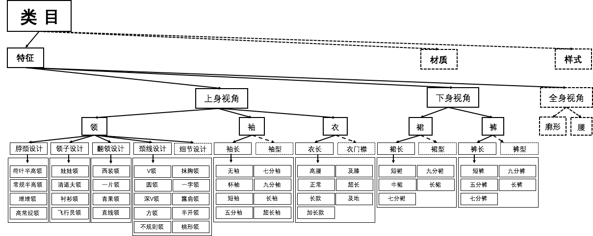
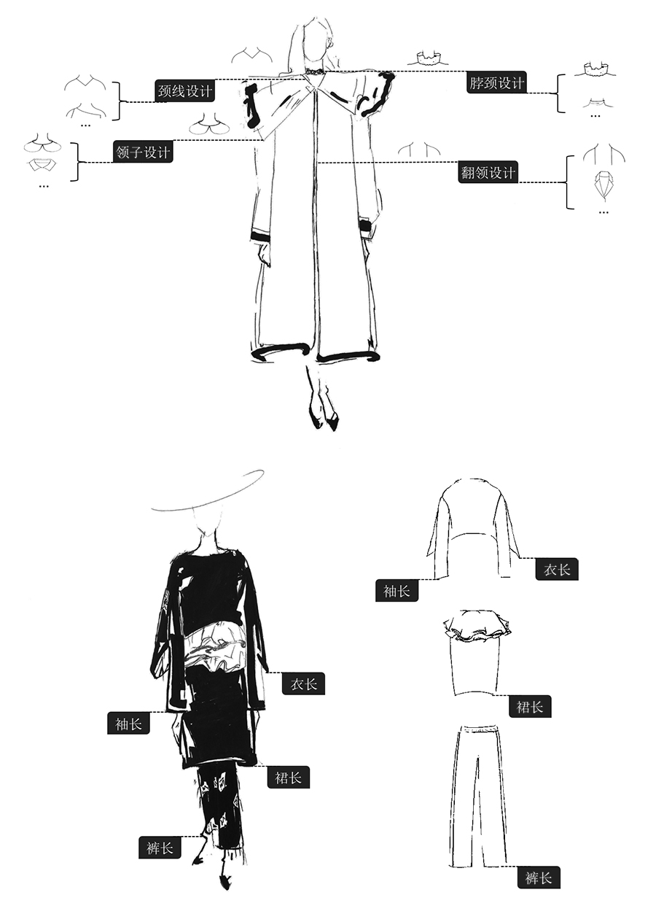

## 一、大赛简介

### 1.1 比赛题目

在本次阿里天池FashionAI全球挑战赛中，我们小组选做了“服饰属性标签”这一赛题。服饰属性标签是构成服饰知识体系的重要根基，内部庞大复杂。比赛举办方对服饰属性进行了专业的整理和抽象，构建了一个符合认知过程，结构化且满足机器学习要求的标签知识体系。由此诞生的服饰属性标签识别技术可以广泛应用在服饰图像检索，标签导航，服饰搭配等应用场景。



### 1.2 数据集说明

比赛官方提供的图像数据来自于阿里电商，其中训练集共79573万张图片。图片被人共分为以下八大类：颈线设计、领子设计、脖颈设计、翻领设计、袖长、衣长、裙长、裤长


每一个大类下又被分为若干个子类，每一个大类的子类数目都不一样。我们的目标是对每一个大类中的图片进行子类细分。

**数据特性：**
a) 互斥：一个属性维度下，属性值之间是互斥的，不能同时成立。比如脖颈设计维度，不能同时既是常规高领，又是荷叶半高领。这是一个“多选一”的问题。
b) 独立：一个图像中，不同属性维度下的属性值可同时存在，它们之间相互独立。比如“领-脖颈设计-常规高领”和“领-领子设计-衬衫领”可以同时存在，且概念上相互独立。
c) 每个属性维度下都有一个属性值叫“不存在”。这个表示当前属性维度在该图像所展示的视角下，是被定义过的，但是该属性在图中并没有出现或者被遮挡看不见。比如一个模特身穿连衣裙的图片，它包含了上身视角和下身视角，所以衣长维度是需要被考虑的，然而它的裙摆被遮住了，衣长维度的属性值是“不存在”。

## 二、实验原理

对于深度学习比赛，我们自然要使用当前热门的深度学习框架来进行建模，在这次比赛中我们使用了PyTorch。我们利用PyTorch搭建了各种模型同时进行训练，以对比不同模型之间的差异。

这些模型的基础都是神经网络，神经网络是一种通用的深度学习模型，可以用于各种各样的分类和回归问题。

假设我们有一个训练样本$(\{x_1,\cdots,x_n\},y)$（$x$为列向量）,然后有权重向量$W$（行向量）和偏置项$b$，我们通过逼近$h_{W,b}(x)=y$的解就可以修正参数，来拟合我们的数据。一个感知机就是最简单的神经网络，也称为一个神经元。如下图所示：


一个神经元以$x_1,x_2,x_3,\cdots$和截距$b$作为输入，输出为$h_{W,b}(x)=f(W^Tx+b)$，其中$f(\cdot)$称为激活函数。

激活函数有很多，比如sigmoid函数:$f(z)=\frac{1}{1+e^{-z}}$，当使用该函数作为激活函数的时候单个神经元的工作就是逻辑回归。

而神经网络，就是多个神经元按照一定的结构连接在一起，用一个神经元的输出作为另一个神经元的输入：


神经网络的的训练主要通过前向传播和反向传播的迭代来更新参数。

####前向传播

神经网络的预测过程称为前向传播。根据上图中的模型，假设有$n_l$层，我们用$L_1,L_2,L_3$来表示输入层，隐藏层，输出层，设置参数集合$\{W,b\}=\{W^{(1)},b^{(1)},W^{(2)},b^{(2)}\}$，$W_{ij}$表示连接第$l$层第$i$个节点和第$(l+1)$层第$j$个节点的权重。

我们用$a^{(l)}$表示第$l$层的输出，则输入层的输出$a^{(1)}=x$，然后我们就可以表示出隐藏层的输出：

​	 $$a^{(2)}_1=f(W^{(1)}_{11}x_1+W^{(1)}_{21}x_2+W^{(1)}_{31}x_3+b^{(1)}_1)$$
	 $$a^{(2)}_2=f(W^{(1)}_{12}x_1+W^{(1)}_{22}x_2+W^{(1)}_{32}x_3+b^{(1)}_2)$$
	 $$a^{(2)}_3=f(W^{(1)}_{13}x_1+W^{(1)}_{23}x_2+W^{(1)}_{33}x_3+b^{(1)}_3)$$

输出层的输出可以表示为：

​	 $$a^{(3)}_1=f(W^{(2)}_{11}a^{(2)}_1+W^{(2)}_{21}a^{(2)}_2+W^{(2)}_{31}a^{(2)}_3+b^{(2)}_1)$$

我们将上述公式转换成矩阵级计算，并用向量$z^{(l)}$来表示第$l$层的加权求和输出，如：$z^{(2)}_1=W^{(1)}_{11}x_1+W^{(1)}_{21}x_2+W^{(1)}_{31}x_3+b^{(1)}_1$，则$z^{(2)}=[z^{(2)}_1,z^{(2)}_2,z^{(2)}_3]$。激活过程可以表示为$f(z^{(2)})=[f(z^{(2)}_1),f(z^{(2)}_2),f(z^{(2)}_3)]$。

使$a^{(1)}=x$，则前向传播的过程就可以简单地表示为：

​	 $$For~l=1,\cdots,n_l-1:$$
	 $$~~~~z^{(l+1)}=W^{(l)}a^{(l)}+b^{(l)}$$
	 $$~~~~a^{(l+1)}=f(z^{(l+1)})$$

####反向传播

 反向传播是神经网络的核心部分，其思想和逻辑回归一样，也是基于梯度下降法。做逻辑回归的时候，我们对输出的损失函数进行求导，用梯度来更新权重。即：

​	 $$W=W-\alpha\nabla C(W)$$

 可是在神经网络中，隐藏层的误差无法通过隐藏层的输出直接估计。但是，根据前向传播的公式，我们可以得出：

​	 $$h_{W,b}(x)=f(W^{(2)}a^{(2)}+b^{(2)})=f(W^{(2)}f(W^{(1)}x+b^{(1)})+b^{(2)})$$

于是我们可以利用链式法则求出每一层的$W$关于输出损失函数的导数。

我们很容易看出，这个链式法则是层层传递的，所以我们可以先求出输出层的导数，然后回传给隐藏层。如果有多个隐藏层，则隐藏层$L_l$的导数还可以回传给隐藏层$L_{l-1}$。我们把每一层的导数中可以回传给上一层的部分称为残差$\delta$。假设神经网络的层数为$n_l$，我们给出反向传播的过程：

- 对于输出层，计算残差：

  ​	       $\delta^{(n_l)}=(a^{(n_l)}-y)f'(z^{(n_l)})$

- 对于各个隐藏层，计算残差：

  ​	       $\delta^{(l)}=((W^{(l)})^T\delta^{(l+1)})f'(z^{(l)})$

- 计算各层参数的偏导数：

  ​	       $\nabla_{W^{(l)}}L_y(a^{(n_l)})=\delta^{(l+1)}(a^{(l)})^T$
  	       $\nabla_{b^{(l)}}L_y(a^{(n_l)})=\delta^{(l+1)}$


以上便是神经网络最基本原理的介绍

#### 扩展神经网络

神经网络早在50年前就被发明出来，这近20年间由于人类计算力的提升得以发扬。在此期间，人们对神经网络的结构、激活函数进行了多方便的研究，单在计算机视觉领域先后推出了CNN， AlexNet， GoogLeNet， VGG，ResNet， DenseNet等不同的神经网络模型。我们主要利用新的模型对这次比赛的数据集进行拟合。

## 三、网络设计

我们尝试设计了以下六种模型，考虑到数据集的特点，我们将八大类的数据分别放进八个子模型中进行训练。

### 3.1 ResNet50&ResNet152

ResNet即Residual Networks 残差网络，2015年MSRA何凯明团队提出的152层深的ResNet在ImageNet上大放异彩。ResNet使得训练深达数百甚至数千层的网络成为可能，而且性能依然优异。

由于其表征能力强，ResNet 在除了图像分类任务之外的许多计算机视觉应用方面也展现了优越的性能，例如对象检测、人脸识别等。

#### 3.1.1 基本原理

根据**万能近似定理（universal approximation theorem）**，只要给定网络足够数量的隐藏单元，一个单层的前馈网络就足以表示任何函数。然而，这个网络层可能大得不可实现，并且容易过拟合数据。因此，学者普遍认为网络架构需要更加深。

> **万能近似定理（universal approximation theorem）**（Hornik et al. 1989, Cybenk 1989）：一个前馈神经网络如果具有线性输出层和至少一层具有任何一种“挤压”性质的激活函数（如logistic sigmoid激活函数）的隐藏层，只要给予网络足够数量的隐藏单元，它可以以任何精度来近似任何从一个有限维空间到另一个有限维空间的Borel可测函数。

可是，如果只是通过层的简单堆叠来增加网络的深度，会导致梯度弥散或梯度爆炸，并不会起到太大的作用。这是因为存在**梯度消失问题（vanishing gradient problem）**，对于深层网络的训练难度很大。当梯度反向传播到前一层时，重复相乘可能使得梯度变得无穷小。结果导致所谓的“退化”，即随着模型的层次加深，其性能趋于饱和，甚至错误率反而会提高。


理论上来说，随着模型的深度加深，学习能力增强，因此层数更深的模型不应该比它浅的模型产生更高的错误率。这种“退化”问题产生的原因可以归咎于优化问题，当模型变得更加复杂，SGD的优化变得更加困难，导致模型的学习效果不理想。

ResNet最根本的动机就是解决这个问题，其核心思想在于提出了一个Residual结构。residual block的构成如下图所示：

<div align = center>


</div>

如果深层网络后面的层是恒等映射（identity mapping），模型就退化为浅层网络，现在要解决的就是学习恒等映射函数的问题。然而，直接让一些层去拟合一个潜在的恒等映射函数$H(x) = x$ 比较困难，这也就是深层网络难以训练的原因。可是，如果我们把网络设计为$H(x) = F(x) + x$ ，问题就可以转换为学习一个残差函数$F(x) = H(x) - x$ 。只要$F(x) = 0$ ，就构成了一个恒等映射$H(x) = x$ 。实验表明，这两种函数表达的效果相同，但是优化的难度不同，拟合残差肯定要更加容易。

简单来说，ResNet就是根据输入将层表示为学习残差函数，残差网络更容易优化，并且能够通过单纯地增加网络深度来提高准确率，解决了退化问题。

ResNet的基本公式如下：
$$
x_l = H_l(x_{l-1}) + x_{l-1}
$$
其中$l$ 表示层，$x_l$ 表示$l$ 层的输出，$H_l$ 表示一个非线性变换。因此在ResNet中，第$l$ 层的输出是$l-1$ 层的输出加上对$l-1$ 层输出的非线性变换。 

另外，Residual block通过一个**”身份捷径连接“（identity shortcut connection）**来实现，通过shortcut直接跳过一层或多层，将输入和输出进行一个element-wise的堆叠，这样简单的加法并不会给网络增加额外的参数和计算量，却可以大大增加模型的训练速度，优化训练效果。

其中shortcut有三种选项可供选择：

1. 使用恒等映射（identity mapping），如果residual block的输入输出维度不一致，对增加的维度用0来填充。
2. 当residual block的输入输出维度一致时采用恒等映射，不一致时使用线性投影以保证维度一致。
3. 对于所有的residual block都使用线性投影。

通过实验，可以发现3的效果优于2，2的效果优于1，但是差距并不大。这表示线性投影并不是必需的，使用0进行填充可以保证模型的复杂度最低，有利于更深的网络结构。

因此随着层数加深，ResNet可以很好地解决退化问题。ResNet152的训练效果要优于ResNet50，不仅错误率大大降低，同时计算复杂度也保持在很低的水平。

#### 3.1.2 核心代码

ResNet主要是封装residual block，有两层的basicBlock和三层的Bottleneck

```python
class BasicBlock(nn.Module):
    expansion = 1
    def __init__(self, inplanes, planes, stride=1, downsample=None):
        #省略

    def forward(self, x):
        residual = x
        out = self.conv1(x)
        out = self.bn1(out)
        out = self.relu(out)
        
        out = self.conv2(out)
        out = self.bn2(out)
        
        if self.downsample is not None:
            residual = self.downsample(x)
            
        out += residual
        out = self.relu(out)

        return out
    
class Bottleneck(nn.Module):
    expansion = 4

    def __init__(self, inplanes, planes, stride=1, downsample=None):
        #省略

    def forward(self, x):
        residual = x

        out = self.conv1(x)
        out = self.bn1(out)
        out = self.relu(out)

        out = self.conv2(out)
        out = self.bn2(out)
        out = self.relu(out)

        out = self.conv3(out)
        out = self.bn3(out)

        if self.downsample is not None:
            residual = self.downsample(x)

        out += residual
        out = self.relu(out)

        return out
```

其余代码相见code/models/resnet.py

### 3.2 DPN131

DPN即Dual Path Networks双通道网络，是一种结合了ResNet和DenseNet优势的新型卷积网络结构，其本身就是一种模型的融合。

ResNet和DenseNet都是近几年比较热门的网络结构，通过用High Order RNN结构（HORNN）把DenseNet和ResNet联系到一起，DenseNet能从靠前的层级中提取到新的特征，而ResNet本质上是对之前层级中已提取特征的复用。通过把这两种结构的优点结合到一起，产生了DPN。

2017 年，基于 ResNet 的双通道网络 DPN 再夺ImageNet冠军，并将200 层 ResNet 的计算量降低了 57%。

#### 3.2.1 基本原理

- **High Order RNN（HORNN）**

  HORNN即高阶循环卷积网络，我们可以用公式表示为：
  $$
  h^k = g^k[ \sum_{t=0}^{k-1} f_t^k(h^t)]
  $$
  其中，当前状态为$h^k$, $h^t$ 表示结构中的第t个状态（t<k），$f_t^k(.)$ 表示从$h^t$ 中提取和第k个状态有关的特征的过程。$x^t$ 表示第t个状态的输入数据（$x^0 = h^0$ ），$g^k(.)$ 表示把之前所有的状态汇聚后再用$g^k(.)$ 处理就得出当前状态$h^k$ 。

  如果对于任意的k, t， 都有$f_t^k(.) = f_t(.)$ , $g^k(.) = g(.)$ ，那么该公式就是一个普通的HORNN。

- **DenseNet**

  DenseNet即Dense Convolutional Network，近两年的卷积神经网络提高效果的改进趋势要么是加深（如ResNet，解决了深层网络的梯度消失问题），要么是加宽（如GoogleNet的Inception），而DenseNet是从feature入手，通过对feature的利用达到更好的效果，并且参数也更少。

  在传统的卷积神经网络结构中，如果是一个L层的网络，那么就会有L个连接。但是在DenseNet中，有$\frac{L(L+1)}{2}$ 个连接。简单来说，DenseNet中每一层的输入都来自于前面所有层的输出。一个Dense block 的结构图如下。如果$x_0$ 是输入，则$H_1$ 的输入是$x_0$ ，$H_2$ 的输入是$x_0$ 和$x_1$ ，其中$x_1$ 是$H_1$ 的输出。 

  

  基于这样的Dense block的设计，DenseNet具有网络更窄、参数更少的优点，每一个卷积层的输出feature-maps的数量都很小（小于100），而不像其他的网络一样有几百上千的宽度。另外，这种连接方式使得特征和梯度的传递都更加有效，网络也就更容易训练。

  在前文中已经提到，网络深度越深，梯度消失问题就越容易出现，原因在于输入信息和梯度信息在很多层之间传递。而在DenseNet中相当于每一层都直接连接input和loss，这样就可以减轻梯度消失现象，网络更深也不再是问题。另外，实验表明这种dense connection有正则化的效果，因此对于过拟合还有一定的抑制作用，可能是因为参数减少了，因此使得过拟合现象减轻。

  DenseNet的基本公式如下：
  $$
  x_l = H_l ([x_0, x_1, ..., x_{l-1}])
  $$
  其中$[x_0, x_1, ..., x_{l-1}]$ 表示将0到$l-1$ 层的输出feature-map进行通道合并（concatenation）。

  因此，我们可以观察到ResNet复用了前面层已经提取过的特征，因此提取的特征中冗余度比较低。而DenseNet中前面层提取出的特征不再是被后面层简单的复用，而是创造了全新的特征，后面层用卷积提取到的特征很有可能是前面层已经提取过的，因此冗余度比较高。


- **DPN**

  DPN的表达式如下所示，它结合了DenseNet和ResNet，$x^k$ 分支代表了DenseNet，$y^k$ 分支代表了ResNet。
  $$
  x^k = \sum_{t=1}^{k-1} f_t^k(h^t)
  $$

  $$
  y^k = \sum_{t=1}^{k-1}v_t(h^t) = y^{k-1} + \phi^{k-1}(y^{k-1})
  $$

  $$
  r^k = x^k + y^k
  $$

  $$
  h^k = g^k (r^k)
  $$

  ResNet和DenseNet都是特殊的HORNN，ResNet更利于参数共享，而DenseNet更有利于获取新的特征。

  DPN的设计结构如下图所示：

  图(a)是ResNet残差网络示意图；

  图(b)是DenseNet的示意图，其中加下划线的1×1卷积是临时增加的，为了和(a)在形式上对齐；

  图(c)表示当将所有的第一个1×1卷积共享后，DenseNet可以退化为残差形式；

  图(d)为DPN双通道网络，同时结合了ResNet和DenseNet的结构，左边的网络是DenseNet的结构，利用concat来连接特征；右边的网络是ResNet结构，利用add来连接特征。

  图(e)为DPN的实现形式。由于DenseNet的concat（拼接）操作会加宽feature map，会增加GPU的负担。因此DPN采用如图(e)所示的网络结构：以ResNet的加和为主体，以DenseNet的拼接为辅助。同时，为了进一步提高网络表达能力，每一个Block的第二个卷积层采用了group操作。

  

  实验证明，DPN在消耗更少的资源下，能够取得更好的结果。

#### 3.2.2 核心代码

DPN的复杂之处是需要并行进行两个网络，需要构造DualPathBlock

```python
class InputBlock(nn.Module):
    def __init__(self, num_init_features, kernel_size=7,
                 padding=3, activation_fn=nn.ReLU(inplace=True)):
        #省略

    def forward(self, x):
        x = self.conv(x)
        x = self.bn(x)
        x = self.act(x)
        x = self.pool(x)
        return x
 
class DualPathBlock(nn.Module):
    def __init__(
            self, in_chs, num_1x1_a, num_3x3_b, num_1x1_c, inc, groups, block_type='normal', b=False):
        #省略

    def forward(self, x):
        x_in = torch.cat(x, dim=1) if isinstance(x, tuple) else x
        if self.has_proj:
            if self.key_stride == 2:
                x_s = self.c1x1_w_s2(x_in)
            else:
                x_s = self.c1x1_w_s1(x_in)
            x_s1 = x_s[:, :self.num_1x1_c, :, :]
            x_s2 = x_s[:, self.num_1x1_c:, :, :]
        else:
            x_s1 = x[0]
            x_s2 = x[1]
        x_in = self.c1x1_a(x_in)
        x_in = self.c3x3_b(x_in)
        if self.b:
            x_in = self.c1x1_c(x_in)
            out1 = self.c1x1_c1(x_in)
            out2 = self.c1x1_c2(x_in)
        else:
            x_in = self.c1x1_c(x_in)
            out1 = x_in[:, :self.num_1x1_c, :, :]
            out2 = x_in[:, self.num_1x1_c:, :, :]
        resid = x_s1 + out1
        dense = torch.cat([x_s2, out2], dim=1)
        return resid, dense
```

之后就是在DPN初始化时，各个Dense block之间的连接组织较为复杂，而且连接数也比其他网络多很多。

```python
class DPN(nn.Module):
    def __init__(self, small=False, num_init_features=64, k_r=96, groups=32,
                 b=False, k_sec=(3, 4, 20, 3), inc_sec=(16, 32, 24, 128),
                 num_classes=1000, test_time_pool=False):
        super(DPN, self).__init__()
        self.test_time_pool = test_time_pool
        self.b = b
        bw_factor = 1 if small else 4

        blocks = OrderedDict()

        # conv1
        if small:
            blocks['conv1_1'] = InputBlock(num_init_features, kernel_size=3, padding=1)
        else:
            blocks['conv1_1'] = InputBlock(num_init_features, kernel_size=7, padding=3)

        # conv2
        bw = 64 * bw_factor
        inc = inc_sec[0]
        r = (k_r * bw) // (64 * bw_factor)
        blocks['conv2_1'] = DualPathBlock(num_init_features, r, r, bw, inc, groups, 'proj', b)
        in_chs = bw + 3 * inc
        for i in range(2, k_sec[0] + 1):
            blocks['conv2_' + str(i)] = DualPathBlock(in_chs, r, r, bw, inc, groups, 'normal', b)
            in_chs += inc

        # conv3
        bw = 128 * bw_factor
        inc = inc_sec[1]
        r = (k_r * bw) // (64 * bw_factor)
        blocks['conv3_1'] = DualPathBlock(in_chs, r, r, bw, inc, groups, 'down', b)
        in_chs = bw + 3 * inc
        for i in range(2, k_sec[1] + 1):
            blocks['conv3_' + str(i)] = DualPathBlock(in_chs, r, r, bw, inc, groups, 'normal', b)
            in_chs += inc

        # conv4
        bw = 256 * bw_factor
        inc = inc_sec[2]
        r = (k_r * bw) // (64 * bw_factor)
        blocks['conv4_1'] = DualPathBlock(in_chs, r, r, bw, inc, groups, 'down', b)
        in_chs = bw + 3 * inc
        for i in range(2, k_sec[2] + 1):
            blocks['conv4_' + str(i)] = DualPathBlock(in_chs, r, r, bw, inc, groups, 'normal', b)
            in_chs += inc

        # conv5
        bw = 512 * bw_factor
        inc = inc_sec[3]
        r = (k_r * bw) // (64 * bw_factor)
        blocks['conv5_1'] = DualPathBlock(in_chs, r, r, bw, inc, groups, 'down', b)
        in_chs = bw + 3 * inc
        for i in range(2, k_sec[3] + 1):
            blocks['conv5_' + str(i)] = DualPathBlock(in_chs, r, r, bw, inc, groups, 'normal', b)
            in_chs += inc
        blocks['conv5_bn_ac'] = CatBnAct(in_chs)

        self.features = nn.Sequential(blocks)

        # Using 1x1 conv for the FC layer to allow the extra pooling scheme
        self.classifier = nn.Conv2d(in_chs, num_classes, kernel_size=1, bias=True)

    def logits(self, features):
        if not self.training and self.test_time_pool:
            x = F.avg_pool2d(features, kernel_size=7, stride=1)
            out = self.classifier(x)
            # The extra test time pool should be pooling an img_size//32 - 6 size patch
            out = adaptive_avgmax_pool2d(out, pool_type='avgmax')
        else:
            x = adaptive_avgmax_pool2d(features, pool_type='avg')
            out = self.classifier(x)
        return out.view(out.size(0), -1)

    def forward(self, input):
        x = self.features(input)
        x = self.logits(x)
        return x
```

另外DPN在训练和预测时需要用到不同的Pooling，其余代码详见code/models/dpn.py

### 3.3 SE-ResNet50&SE-ResNet152

SE-ResNet也是一个融合模型，它是ResNet和SENet的组合。

#### 3.3.1 基本原理

SENet即Squeeze-and-Excitation Networks，它是由自动驾驶公司Momenta在2017年公布的一种全新的图像识别结构，它通过对特征通道间的相关性进行建模，把重要的特征进行强化来提升准确率。

下图是SENet的Block单元，图中的$F_{tr}$ 是传统的卷积结构，$X$  和$U$ 是$F_{tr}$ 的输入（$C' × H' × W'$ ）和输出（$C×H×W$ ），这些都是以往的结构中已经存在的。


SENet增加的部分是$U$ 以后的结构：

1. 对$U$ 先做一个Global Average Pooling，即图中的$F_{sq}(.)$ ，我们称其为Squeeze挤压过程。公式如下：
   $$
   z_c = F_{sq}(u_c) = \frac{1}{W×H}\sum_{i=1}^{W}\sum_{j=1}^{H} u_c(i,j)
   $$
   这一步将$H×W×C$ 的输入转换成$1×1×C$ 的输出，结果相当于表明该层C个feature map的数值分布情况，成为全局信息。

2. 输出的$1×1×C$ 数据再经过两级全连接，即图中的$F_{ex}(.)$ ，我们称其为Excitation激发过程。再经过sigmoid函数，将输出限制在[0,1]范围内。公式如下：
   $$
   s = F_{ex}(z, W) = \sigma(g(z, W)) = \sigma(W_2\sigma(W_1z))
   $$
   先用$W_1$ 乘以$z$ ，就是一个全连接层操作，$W_1$ 的维度是$\frac{C}{r}× C$ ，r是一个缩放参数，目的是为了减少channel 个数从而降低计算量。$z$ 的维度是$1×1×C$ ，因此$W1z$ 的计算结果为$1×1×\frac{C}{r}$ 。

   再经过一个ReLU层，输出的维度不变；

   然后再与$W_2$ 相乘，也是一个全连接层的过程。$W_2$ 的维度是$C×\frac{C}{r}$ ，因此输出的维度是$1×1×C$ 。

   最后再经过一个sigmoid函数，得到$s$。 

3. 最后再把这个值作为scale乘到$U$ 的$C$ 个通道上，作为下一级的输入数据。公式如下：
   $$
   \overset{\sim}{x_c} = F_{scale}(u_c, s_c) = s_c \cdot  u_c
   $$
   其中$u_c$ 是一个二维矩阵，$s_c$ 是一个常数，代表权重，因此就相当于把$u_c$ 矩阵中的每一个值都乘以$s_c$ 。

这种结构的目的在于通过控制scale的大小，把重要的特征增强，不重要的特征减弱。从而让提取的特征的指向性更强。

SE-ResNet实际上是ResNet和SENet的组合，这种结构将scale放到了ResNet的直连相加之前。具体如下图：


#### 3.3.2 核心代码

SE-ResNet基于ResNet增加了SENet子模型，需要构造更多的子模型，首先是SE模型

```python
class SEModule(nn.Module):

    def __init__(self, channels, reduction):
        #省略

    def forward(self, x):
        module_input = x
        x = self.avg_pool(x)
        x = self.fc1(x)
        x = self.relu(x)
        x = self.fc2(x)
        x = self.sigmoid(x)
        return module_input * x
```

然后融入ResNet中

```python
class SEResNetBottleneck(Bottleneck):
    """
    ResNet bottleneck with a Squeeze-and-Excitation module. It follows Caffe
    implementation and uses `stride=stride` in `conv1` and not in `conv2`
    (the latter is used in the torchvision implementation of ResNet).
    """
    expansion = 4

    def __init__(self, inplanes, planes, groups, reduction, stride=1,
                 downsample=None):
        super(SEResNetBottleneck, self).__init__()
        self.conv1 = nn.Conv2d(inplanes, planes, kernel_size=1, bias=False,
                               stride=stride)
        self.bn1 = nn.BatchNorm2d(planes)
        self.conv2 = nn.Conv2d(planes, planes, kernel_size=3, padding=1,
                               groups=groups, bias=False)
        self.bn2 = nn.BatchNorm2d(planes)
        self.conv3 = nn.Conv2d(planes, planes * 4, kernel_size=1, bias=False)
        self.bn3 = nn.BatchNorm2d(planes * 4)
        self.relu = nn.ReLU(inplace=True)
        self.se_module = SEModule(planes * 4, reduction=reduction)
        self.downsample = downsample
        self.stride = stride
```

其余代码详见：code/models/senet.py

### 3.4 VGG19

模型的名称“VGG"代表了牛津大学的Oxford Visual Geometry Group，该小组隶属于Robotics Research Group。

该模型在2014年的ILSVRC比赛中获得第二名，它的主要贡献是论证了卷积神经网络的深度增加和小卷积核的使用对于网络的最终分类识别效果有很大的作用。

#### 3.4.1 基本原理

VGG是从Alex-net发展而来的网络，主要修改了以下两个方面

1. 小卷积核：在第一个卷积层中使用了更小的卷积核尺寸和间隔（3×3）。
2. 多尺度：训练和测试整张图的不同尺度。

- **小卷积核**

  VGGNet全部使用了3×3卷积，卷积不但涉及到计算量，还影响到感受野。计算量关系到是否方便部署到移动端、是否能满足实时处理、是否易于训练等；感受野关系到参数更新、特征图的大小、特征是否提取的足够多、模型的复杂度和参数量等。

  在计算量方面，通过实验可以对conv3×3、conv5×5、conv7×7、conv9×9和conv11×11，在224×224×3的RGB图上做卷积，卷积层的参数规模和得到的feature map大小如下图所示：

  

  我们从上表中可以观察到，单独看卷积核参数和特征图参数，不同kernel大小下这两者加和的结构都是30万的参数量。也就是说，在同样的stride下，卷积核的大小对于参数量来说影响不大。

  然而，对于卷积的计算量来说，conv3×3、conv5×5、conv7×7、conv9×9和conv11×11的计算规模依次为：1600万、4500万、1.4亿、2亿。因此，越大的卷积核，计算量越大。

  因此，我们可以得出结论：几个小滤波器卷积层的组合要比一个大滤波器卷积层的效果更好。通常多个卷积层与非线性的激活层交替的结构，比单一卷积层的结构更能提取出深层的更好的特征。前者使用的参数更少，也更能表达出输入数据的多个明显特征。唯一的不足在于，在进行反向传播时，中间的卷积层可能会导致占用更多的内存。


- **感受野**

  感受野receptive field指的是在卷积神经网络中，决定某一层输出结果中一个元素所对应的输入层的区域大小，被称作感受野。通俗来讲，就是feature map上的一个点对应输入图上的区域。

  两个3×3的卷积堆叠得到的感受野大小相当于一个5×5的卷积；而3个3×3卷积堆叠得到的感受野大小相当于一个7×7的卷积。

**VGG的网络结构**如下图所示：


**VGG的三大优势：**

1. 更多的激活函数、更丰富的特征、更强的辨别能力。更多的卷积核的使用可以使决策函数更加具有辨别能力。3个3×3卷积可以近似与一个7×7，网络深了两层并且多出了两个非线性ReLU函数，使得网络容量更大，对于不同类别的区分能力更强。
2. 卷积层的参数减少，相比于5×5、7×7和11×11的大卷积核，3×3明显地减少了参数量。
3. 小卷积核代替大卷积核的正则作用带来性能提升。

**引入BN层的VGG19**

&emsp;在本次实验中，我们使用了引入BN层的VGG19网络。在VGG中的每一个卷积层后面都加一个BN层，来使每层训练结果的输出在同一分布下，既可以加速收敛速度，也可以达到更高的准确率。

#### 3.4.2 核心代码

和基础的CNN网络一样，VGG也是分为特征提取和分类两大部分，分类器相对简单，在初始化中构造

```python
class VGG(nn.Module):

    def __init__(self, features, num_classes=1000, init_weights=True):
        super(VGG, self).__init__()
        self.features = features
        self.classifier = nn.Sequential(
            nn.Linear(512 * 7 * 7, 4096),
            nn.ReLU(True),
            nn.Dropout(),
            nn.Linear(4096, 4096),
            nn.ReLU(True),
            nn.Dropout(),
            nn.Linear(4096, num_classes),
        )
        if init_weights:
            self._initialize_weights()
```

而特征提取层的层数时可以定制的，由于VGG结构比较简单，所有的layer可以用一个函数进行构造

```python
def make_layers(cfg, batch_norm=False):
    layers = []
    in_channels = 3
    for v in cfg:
        if v == 'M':
            layers += [nn.MaxPool2d(kernel_size=2, stride=2)]
        else:
            conv2d = nn.Conv2d(in_channels, v, kernel_size=3, padding=1)
            if batch_norm:
                layers += [conv2d, nn.BatchNorm2d(v), nn.ReLU(inplace=True)]
            else:
                layers += [conv2d, nn.ReLU(inplace=True)]
            in_channels = v
    return nn.Sequential(*layers)
```

当需要构造VGG19时，只需要使cfg为：

```python
[64, 64, 'M', 128, 128, 'M', 256, 256, 256, 256, 'M', 512, 512, 512, 512, 'M', 512, 512, 512, 512, 'M']
```

其余代码详见code/models/vgg.py

## 四、实验结果与思考

由于我们组没有参加比赛，没有办法在官方测试集上做测试，所以我们选择将训练集按照4:1随机划分成训练集和验证集。我们对每个attribute都使用了6个网络（epochs在50-60）来训练和验证，下面是各个网络在验证集上取得的最好效果（全部结果可以在result文件夹中查看）。

* **coat_length_labels**

  |     网络     | resnet50 | resnet152 | se-resnet50 | se-resnet152 | vgg19_bn | dpn131 |
  | :--------: | :------: | :-------: | :---------: | :----------: | :------: | :----: |
  | val acc(%) |    70    |    82     |     77      |      80      |    83    |   84   |

* **collar_design_labels**

  |     网络     | resnet50 | resnet152 | se-resnet50 | se-resnet152 | vgg19_bn | dpn131 |
  | :--------: | :------: | :-------: | :---------: | :----------: | :------: | :----: |
  | val acc(%) |    59    |    74     |     66      |      72      |    81    |   80   |

* **lapel_design_labels**

  |     网络     | resnet50 | resnet152 | se-resnet50 | se-resnet152 | vgg19_bn | dpn131 |
  | :--------: | :------: | :-------: | :---------: | :----------: | :------: | :----: |
  | val acc(%) |    59    |    76     |     66      |      74      |    82    |   79   |

* **neck_design_labels**

  |     网络     | resnet50 | resnet152 | se-resnet50 | se-resnet152 | vgg19_bn | dpn131 |
  | :--------: | :------: | :-------: | :---------: | :----------: | :------: | :----: |
  | val acc(%) |    53    |    56     |     58      |      64      |    73    |   71   |

* **neckline_design_labels**

  |     网络     | resnet50 | resnet152 | se-resnet50 | se-resnet152 | vgg19_bn | dpn131 |
  | :--------: | :------: | :-------: | :---------: | :----------: | :------: | :----: |
  | val acc(%) |    73    |    78     |     74      |      76      |    82    |   81   |

* **pant_length_labels**

  |     网络     | resnet50 | resnet152 | se-resnet50 | se-resnet152 | vgg19_bn | dpn131 |
  | :--------: | :------: | :-------: | :---------: | :----------: | :------: | :----: |
  | val acc(%) |    70    |    79     |     73      |      79      |    83    |   84   |

* **skirt_length_labels**

  |     网络     | resnet50 | resnet152 | se-resnet50 | se-resnet152 | vgg19_bn | dpn131 |
  | :--------: | :------: | :-------: | :---------: | :----------: | :------: | :----: |
  | val acc(%) |    74    |    80     |     79      |      82      |    83    |   84   |

* **sleeve_length_labels**

  |     网络     | resnet50 | resnet152 | se-resnet50 | se-resnet152 | vgg19_bn | dpn131 |
  | :--------: | :------: | :-------: | :---------: | :----------: | :------: | :----: |
  | val acc(%) |    77    |    83     |     80      |      84      |    86    |   87   |

从上面的结果我们可以发现：

1. 在这个数据集上，相同网络模型下，层数越深，效果越好（对比resnet50和resnet152、se-resnet50和se-resnet152），这是因为网络越深表达能力越强，能处理的训练数据也更多。
2. 融合网络模型的效果通常比单一网络模型的效果更好，这是因为融合网络模型结合了不同网络的优点。

####思考

这一次我们对于每个模型都使用了8个网络同时进行训练的方式建模，其实这有点浪费资源，根据数据集的特点，我们可以训练上半身和下半身两个大网络生成特征图，然后用8个全连接小网络进行识别，这在实际的比赛中更具泛用性。


## 五、参考文献

[1] 《Densely Connected Convolutional Networks》, Gao Huang,  Zhuang Liu, Laurens van der Maaten

[2] 《Dual Path Networks》, Yunpeng Chen, Jianan Li, Huaxin Xiao, Xiaojie Jin, Shuicheng Yan, Jiashi Feng

[3] 《Deep Residual Learning for Image Recognition》, Kaiming He, Xiangyu Zhang, Shaoqing Ren, Jian Sun

[4] 《Squeeze-and-Excitation Networks》, Jie Hu, Li Shen,  Gang Sun

[5] 《Very Deep Convolutional Networks For Large-Scale Image Recognition》, Karen Simonyan,  Andrew Zisserman