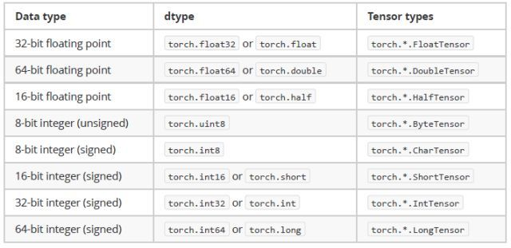

# pytorch 4.0  主要 变化

### 1.合并Tensor 和 Variable类

本次升级将Tensor 类和 Variable 类 合并, 这一合并, 解决掉了很多原来令人困扰的问题.

在旧版本, Variable和Tensor分离, Tensor主要是多维矩阵的封装, 而Variable类是计算图上的节点, 它对Tensor进行了进一步的封装.

所以, 在训练过程中, 一个必要的步骤就是, 把Tensor转成Variable以便在模型中运行; 运行完之后, 我们还要将Variable转成Tensor,甚至Numpy. 我们在写代码和读代码的时候, 看到了各种辅助函数, 比如下面就是我常用的辅助函数:

```javascript
# 旧版本实现
import torch

# 从Tensor转换到Vairable
def to_var(x):
    if torch.cuda.is_available():
        x = x.cuda()
    return Variable(x)  
  
# 从CUDA Variable转换到Numpy
def to_np(x):
    return x.data.cpu().numpy()
     
for epoch in range(3):   # 训练3轮
   for step, (batch_x, batch_y) in enumerate(loader):  # 每一步
      # 把训练数据转成Variable
      batch_x, batch_y = to_var(batch_x), to_var(batch_y)
      pass
```

0.4.0, 我们就可以不用这么转化了

```javascript
for epoch in range(3):   # 训练3轮
   for step, (batch_x, batch_y) in enumerate(loader):  # 每一步
       optimizer.zero_grad()
          # forward + backward + optimize
       outputs = net(batch_x)
       loss = criterion(outputs, batch_y)
       loss.backward()
       optimizer.step()

print('Finished Training')
```

* `torch.autograd.Variable` 和 `torch.Tensor`现在是同一个类.

* 更准确的说是`torch.Tensor`包括了`Variable`，所以我们都称之为Tensor好了。

*  `Variable`还能像以前一样工作，但是返回的类型是`torch.Tensor`。

* 这样也就意味着你没必要在代码中用`Variable`将变量包装起来了。

###2.获取Tensor 类型的函数变了

- 原来是：`type(x)` 
- 现在是: `x.type()` 
- 还有`isinstance()`函数的用法具体如下：

~~~c 
```source-python
>>> x = torch.DoubleTensor([1, 1, 1])
>>> print(type(x)) # was torch.DoubleTensor
<class 'torch.autograd.variable.Variable'>
>>> print(x.type())  # OK: 'torch.DoubleTensor'
'torch.DoubleTensor'
>>> print(isinstance(x, torch.DoubleTensor))  # OK: True
True
~~~


###3.关于自动求梯度用法的变迁

- 自动求梯度`requires_grad`现在是`Tensor`的属性。
- 具体的使用可以见这个例子：

~~~cmd
```source-python
>>> x = torch.ones(1)  # create a tensor with requires_grad=False (default)
>>> x.requires_grad
False
>>> y = torch.ones(1)  # another tensor with requires_grad=False
>>> z = x + y
>>> # both inputs have requires_grad=False. so does the output
>>> z.requires_grad
False
>>> # then autograd won't track this computation. let's verify!
>>> z.backward()
RuntimeError: element 0 of tensors does not require grad and does not have a grad_fn
>>>
>>> # now create a tensor with requires_grad=True
>>> w = torch.ones(1, requires_grad=True)
>>> w.requires_grad
True
>>> # add to the previous result that has require_grad=False
>>> total = w + z
>>> # the total sum now requires grad!
>>> total.requires_grad
True
>>> # autograd can compute the gradients as well
>>> total.backward()
>>> w.grad
tensor([ 1.])
>>> # and no computation is wasted to compute gradients for x, y and z, which don't require grad
>>> z.grad == x.grad == y.grad == None
True
~~~

如上所示，我们可以得到如下信息：

- 默认情况创建的张量不需要梯度；
- 所有的输入inputs都不需要张量，那么输出也不需要计算梯度；
- 当我们希望创建的张量自动计算梯度时，在定义的时候加上`requires_grad=True` 
- 当输入inputs中的有一个需要梯度时，那么输出也会自动计算梯度
- 但是其他不在定义的时候不需要计算梯度的张量在反向传播及求梯度的时候就不再计算这些张量的梯度了；

除了在定义的时候指定变量需要计算梯度外，也可以用函数`requires_grad_()`来对已经存在的张量设置`requires_grad`属性。

~~~cmd
```source-python
>>> existing_tensor.requires_grad_()
>>> existing_tensor.requires_grad
True
>>> my_tensor = torch.zeros(3, 4, requires_grad=True)
>>> my_tensor.requires_grad
True
~~~

### 4 关于`.data` 

- 之前是用`.data`来获取`Variable`中的`Tensor` 
- 合并以后也有类似的用法，`y=x.data`，y会是一个跟x数据一样的新张量，默认不计算梯度。
- 某些情况下，使用`.data`会比较不安全。因为所有在`x.data`中出现的变换就不再被`autugrad`记录了，在反向传播计算梯度的时候可能就会出错。
- 比较安全的方式是使用`x.detach()`，虽然返回的还是没是不计算梯度的张量，但是这个张量所作的in-place变换还是会被`autograd`自动记录到。

### 5. 开始支持0维标量

- 以前pytorch会将标量都扩展成1维的张量`（1，）` 
- 现在开始支持标量的存在了。
- 具体的标量使用方法以及向量vector使用方法都如下所示：

~~~cmd
```source-python
>>> torch.tensor(3.1416)         # create a scalar directly
tensor(3.1416)
>>> torch.tensor(3.1416).size()  # scalar is 0-dimensional
torch.Size([])
>>> torch.tensor([3]).size()     # compare to a vector of size 1
torch.Size([1])
>>>
>>> vector = torch.arange(2, 6)  # this is a vector
>>> vector
tensor([ 2.,  3.,  4.,  5.])
>>> vector.size()
torch.Size([4])
>>> vector[3]                    # indexing into a vector gives a scalar
tensor(5.)
>>> vector[3].item()             # .item() gives the value as a Python number
5.0
>>> sum = torch.tensor([2, 3]).sum()
>>> sum
tensor(5)
>>> sum.size()
torch.Size([])
~~~

所以以后在神经网络中计算损失的时候要将原来的`total_loss += loss.data[0]`改成`total_loss += loss.item()`

### 6. 限制了`volatile`标志位的使用

- 原来用在`Variable`中使用`volatile=True`会让`autograd`不再计算梯度值。
- 现在这个标志位被限制了，即使用了也没有作用。
- pytorch用了更加灵活的方式来代替，具体的使用方法如下所示：

~~~cmd
```source-python
>>> x = torch.zeros(1, requires_grad=True)
>>> with torch.no_grad():
...     y = x * 2
>>> y.requires_grad
False
>>>
>>> is_train = False
>>> with torch.set_grad_enabled(is_train):
...     y = x * 2
>>> y.requires_grad
False
>>> torch.set_grad_enabled(True)  # this can also be used as a function
>>> y = x * 2
>>> y.requires_grad
True
>>> torch.set_grad_enabled(False)
>>> y = x * 2
>>> y.requires_grad
False
~~~


###7.合并之后, 新版本Tensor是什么类型?

torch.Tensor类型, 但是, 详细类型需要进一步调用方法:

```javascript
>>> import torch
>>> x = torch.DoubleTensor([1, 1, 1])
>>> type(x)  
<class 'torch.Tensor'>
>>> x.type() 
'torch.DoubleTensor'
>>> isinstance(x, torch.DoubleTensor)
True
```

旧版本的PyTorch, 你可以在类型上直接看出一个Tensor的基本信息, 比如device在cuda上, layout是sparse,dtype是Float型的Tensor, 你可以:

```javascript
# 0.3.1
>>> type(a)
<class 'torch.cuda.sparse.FloatTensor'>
```

由新版本, 所有的Tensor对外都是torch.Tensor类型, 上述的属性, 从类名转移到了Tensor的属性了.

**•  torch.device, 描述设备的位置, 比如torch.device('cuda'), torch.device('cpu')**

```javascript
>>> import torch
>>> cuda = torch.device('cuda') 
>>> cpu  = torch.device('cpu')
>>> a = torch.tensor([1,2,3], device=cuda)
>>> a.device
device(type='cuda', index=0)
>>> b = a.to(cpu) # 将数据从cuda copy 到 cpu
>>> b.device
device(type='cpu')
>>> type(a)  # type a 和 tpye b, 看不出谁在cuda谁在cpu
<class 'torch.Tensor'>
>>> type(b)
<class 'torch.Tensor'>
```

**•  torch.layout**

torch.layout 是 一个表示Tensor数据在内存中样子的类, 默认torch.strided, 即稠密的存储在内存上, 靠stride来刻画tensor的维度. 目前还有一个实验版的对象torch.sparse_coo, 一种coo格式的稀疏存储方式, 但是目前API还不固定, 大家谨慎使用.

**•  torch.dtype**




GitHub 发布地址：https://github.com/pytorch/pytorch/releases

PyTorch 官网：http://pytorch.org/